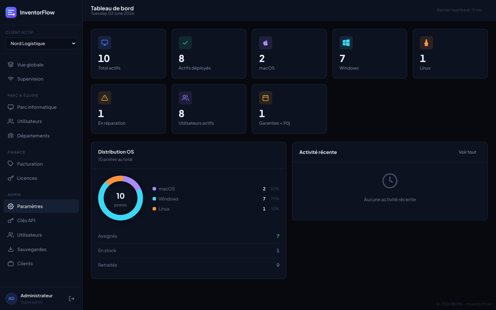
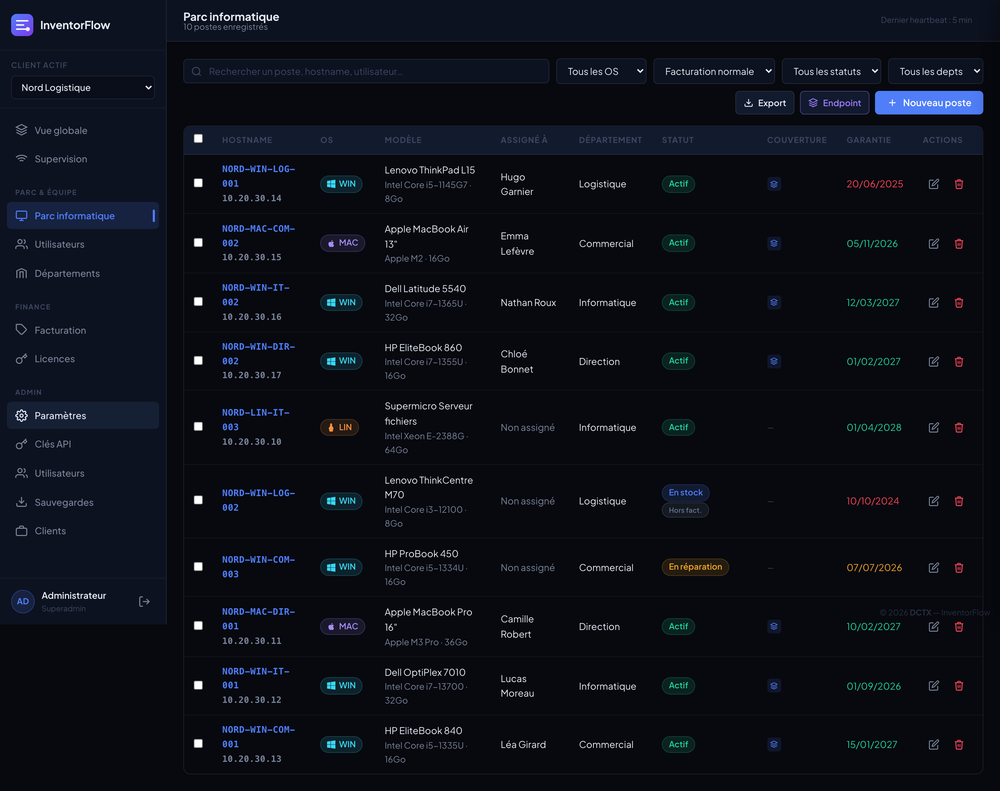
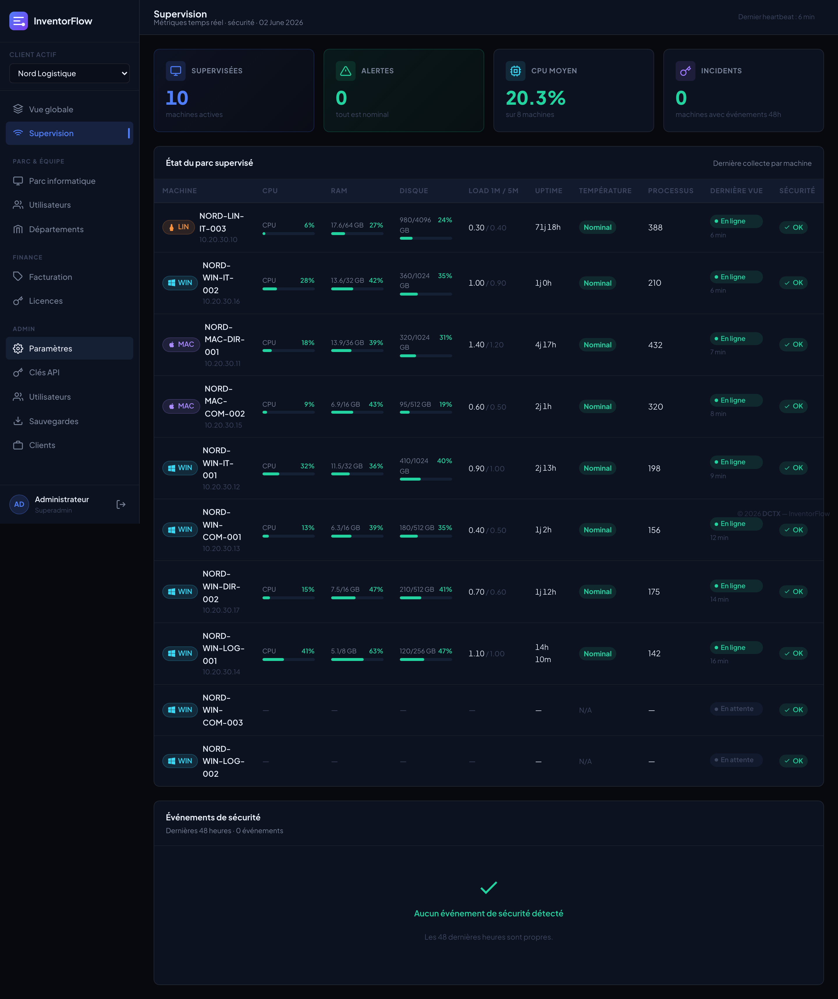
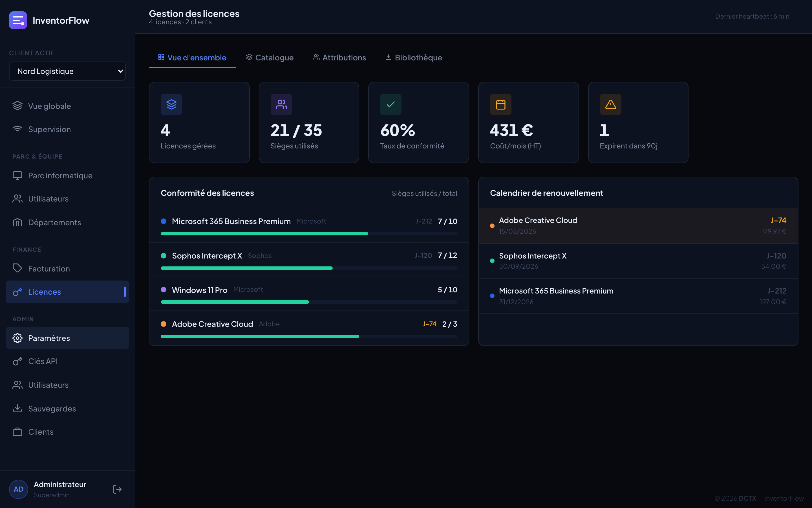
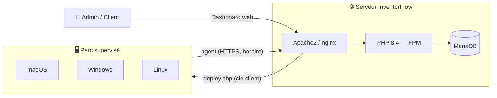

<div align="center">

# 🗂️ Inventor-Flow

### Gestion de parc informatique multi-client — inventaire, supervision, licences & facturation

*Une seule application, auto-hébergée, pour piloter tout votre parc IT et celui de vos clients.*

<br>


<br>

[🐳 Démarrage Docker](#-démarrage-rapide-docker) •
[Fonctionnalités](#-fonctionnalités) •
[Architecture](#%EF%B8%8F-architecture) •
[Installation](#-installation) •
[Agent](#-déploiement-de-lagent) •
[Stack](#-stack-technique)

</div>

---

## ⚡ Démarrage rapide (Docker)

```bash
cp .env.example .env       # réglez les mots de passe (base, admin)
docker compose up -d --build
```

➜ **http://localhost:8080** *(ou `http://<IP_DU_SERVEUR>:8080` à distance)* — login `admin` / `ADMIN_PASS`
La base, le compte admin et les migrations sont initialisés automatiquement. *([détails & options →](#-avec-docker-le-plus-rapide))*

---

## 📋 Présentation

**InventorFlow** est une plateforme web auto-hébergée de **gestion de parc informatique** pensée pour les prestataires IT et MSP. Elle centralise l'**inventaire matériel**, la **supervision temps réel**, la **gestion des licences logicielles** et la **facturation récurrente** — le tout en **multi-client**, avec un agent de monitoring léger déployable en une seule commande.

> Dark mode soigné (OLED), interface en français, zéro framework lourd — rapide et auto-hébergeable sur un simple serveur Debian/Ubuntu.

<div align="center">
  
  <br><sub><em>Tableau de bord — vue d'ensemble du parc</em></sub>
</div>

---

## 📸 Captures d'écran

<div align="center">

**Parc informatique** — inventaire multi-OS, sélection multiple & attribution de licences


<br>

**Supervision temps réel** — CPU, RAM, disque, température, alertes de sécurité


<br>

**Gestion des licences** — conformité, sièges, renouvellements, marge


</div>

---

## ✨ Fonctionnalités

### 🖥️ Inventaire du parc
- CRUD complet des postes **macOS / Windows / Linux** (hostname, n° série, CPU, RAM, stockage, IP, MAC)
- Attribution **poste ↔ utilisateur** avec historique des assignations
- Statuts : actif, stock, réparation, retiré
- Export **CSV** et badges OS colorés
- Système de **nommage normalisé** par templates (`{CLIENT}-{OS}-{DEPT}-{SEQ}`) avec suggestions

### 👥 Multi-client
- Sélecteur de client dans la barre latérale
- **Clé de déploiement** auto-générée par client
- Isolation des données par `client_id` sur toutes les vues

### 📡 Supervision temps réel
- Agent **universel** (**macOS, Windows, Linux**) qui remonte chaque heure : CPU, RAM, disque, load, uptime, processus
- **Température CPU** multi-plateforme (Apple Silicon, Intel SMC, Linux `sensors`)
- Détection de **brute-force SSH** (auth.log / journalctl) avec whitelist LAN
- Dashboard à barres colorées, statuts *heartbeat* et alertes de sécurité

### 🔑 Licences logicielles
- Catalogue **HT / TTC** (TVA 20 %) avec prix d'achat **et** prix de revente / marge
- Attribution par **poste** ou par **utilisateur**, panneau latéral dédié
- Barre de **conformité** (sièges utilisés / total) et alertes de renouvellement (J-90, J-30, expiré)

### 💶 Facturation
- Catalogue de services (par poste, par utilisateur, forfait, horaire)
- Abonnements client ↔ service avec calcul **automatique** selon les ressources actives
- **MRR / ARR** et marge nette calculés en continu

### 👤 Employés & départements
- Profil employé complet (machines, licences actives, coût mensuel estimé)
- **Assistant d'offboarding** : retour au stock, révocation/transfert des licences en cascade
- Vue **département** consolidée (utilisateurs / postes / licences)

### 📊 Pilotage
- **Tableau de bord unifié** avec widgets personnalisables (ordre + visibilité sauvegardés)
- **Rapports PDF** double version : *interne* (marges visibles) et *client* (marges masquées)
- Gestion des **comptes** : rôles superadmin / admin / viewer

---

## 🏗️ Architecture



**Principe :** un serveur central (PHP-FPM + MariaDB) expose le dashboard et l'API. Chaque poste reçoit, via une commande unique générée par `deploy.php`, un **agent** (bash sous macOS/Linux, PowerShell sous Windows) qui s'auto-installe et envoie ses métriques toutes les heures.

---

## 🐳 Avec Docker (le plus rapide)

Pour essayer ou déployer InventorFlow sans configurer la pile à la main :

```bash
cp .env.example .env      # réglez les mots de passe (base, admin) avant le 1er démarrage
docker compose up -d --build
```

➜ **Application** : http://localhost:8080 *(ou `http://<IP_DU_SERVEUR>:8080` si Docker tourne sur une machine distante)*
➜ **Login** : `admin` / valeur de `ADMIN_PASS`

La base de données, le compte administrateur et les migrations sont initialisés **automatiquement** au premier démarrage. Les données (base + `backups/`) persistent dans des volumes Docker. Idéal pour l'essai et le développement ; pour une exposition publique, placez un reverse-proxy HTTPS devant.

---

## 🚀 Installation

Déploiement automatisé sur **Debian 11+/Ubuntu 22.04+** (Apache2 + PHP-FPM + MariaDB), via le pack de release :

```bash
unzip inventorflow-deploy.zip -d if-install
cd if-install
sudo bash install.sh
```

L'installeur, **interactif et idempotent**, gère :
- la détection de l'OS et la meilleure version de PHP disponible ;
- l'installation des dépendances manquantes uniquement ;
- la configuration **PHP-FPM + proxy_fcgi**, la base de données, le vhost et les permissions ;
- l'import du schéma et la création du compte administrateur (hash bcrypt).

```
➜  App   : http://<IP_DU_SERVEUR>:8080
➜  Login : admin
```

> Port, identifiants DB et mot de passe admin se règlent en tête de `install.sh`.

> ### 🔐 OBLIGATOIRE — changez les mots de passe par défaut
> L'installeur fournit des identifiants **par défaut, publics** :
> `DB_PASS="InventorFlow2024!"` et `ADMIN_PASS="AdminTest2024!"`.
> **Tels quels, votre installation n'est pas sécurisée.** Changez-les :
> - **Avant l'install** : éditez les valeurs en tête de `install.sh`.
> - **Après l'install** : mot de passe admin via **Paramètres → Utilisateurs** ; mot de passe BDD via `config/db.php` + `ALTER USER` MariaDB.
>
> 👉 Procédure détaillée : **[Wiki — Sécurité & mots de passe](https://github.com/The-DCTX/Inventorflow/wiki/Securite-mots-de-passe)**

---

## 📦 Déploiement de l'agent

Depuis la fiche d'un client, le bouton **« Déployer l'agent »** fournit une commande prête à coller sur le poste :

```bash
# macOS
sudo bash -c "$(curl -fsSL 'https://votre-serveur/deploy.php?key=CLE_CLIENT')"

# Linux
curl -fsSL 'http://votre-serveur:8083/deploy.php?key=CLE_CLIENT' | bash
```

```powershell
# Windows (PowerShell en administrateur)
powershell -ExecutionPolicy Bypass -Command "& {[Net.ServicePointManager]::SecurityProtocol=[Net.SecurityProtocolType]::Tls12; Invoke-Expression (New-Object Net.WebClient).DownloadString('https://votre-serveur/deploy.php?key=CLE_CLIENT&os=win')}"
```

L'agent s'enrôle automatiquement et remonte ses métriques toutes les heures :
- **macOS / Linux** — script bash portable (testé macOS 12+, Debian, RHEL, XCP-ng).
- **Windows** — agent PowerShell (`agent.ps1`) installé en **service** (démarrage automatique).

---

## 🧰 Stack technique

| Couche | Technologie |
|---|---|
| **Backend** | PHP 8.4 (PDO, sans framework) |
| **Base de données** | MariaDB / MySQL (utf8mb4) |
| **Frontend** | HTML + CSS (dark mode OLED) + Vanilla JS |
| **Serveur web** | Apache2 ou nginx + PHP-FPM |
| **Agent** | Bash universel (macOS / Linux) |
| **Rapports** | Génération PDF interne/client |

---

## 📁 Structure du projet

```
inventor-flow/
│  ── Pages web (servies directement par l'URL) ──
├── index.php             # Tableau de bord
├── login.php             # Connexion  (login-totp.php : 2ᵉ étape TOTP)
├── recovery.php          # Restauration de secours (page autonome)
├── deploy.php            # Générateur d'installeur d'agent (clé par client)
│
│  ── Code applicatif ──
├── pages/                # Vues (parc, supervision, licences, facturation…)
├── api/                  # Endpoints REST (assets, restore, totp, monitoring…)
├── includes/             # Auth, TOTP, LDAP, layout, fonctions partagées
├── config/               # Connexion DB + config (générés à l'installation)
├── assets/               # CSS (thèmes) + JS (toasts, modales, helpers API)
├── agent/                # Agent de supervision (bash universel + PowerShell)
│
│  ── Déploiement & données ──
├── install/              # Installeur bare-metal (install.sh + install.sql)
├── migrations/           # Migrations SQL additives (migrate.php)
├── maintenance/          # backup / restore / update / purge / tuning
├── Dockerfile            # Image PHP 8.4 + Apache
├── docker-compose.yml    # Pile complète (app + MariaDB)
├── docker/               # entrypoint.sh (initialisation au démarrage)
│
└── docs/ · vendor/       # Captures & page GitHub Pages · dépendances
```

---

## 🔒 Sécurité

- ⚠️ **Identifiants par défaut à changer immédiatement** (`DB_PASS`, `ADMIN_PASS`) — voir **[Wiki — Sécurité & mots de passe](https://github.com/The-DCTX/Inventorflow/wiki/Securite-mots-de-passe)**
- Authentification par session, mots de passe en **bcrypt**
- En-têtes `X-Content-Type-Options`, `X-Frame-Options`
- API d'enrôlement protégée par **clé d'API** par client
- Détection et journal des tentatives de **brute-force SSH**

---

## ⚠️ Avertissement

L'installeur (`install.sh`) **s'exécute en `root`** et effectue des opérations système : installation de paquets, configuration d'Apache/PHP/MariaDB, écriture de fichiers de configuration. Une option permet, sur confirmation explicite, de **réinitialiser une base de données existante**.

- **Sauvegardez vos données avant toute installation** sur un serveur déjà en service.
- Privilégiez un **serveur dédié ou une VM** pour le premier déploiement.
- L'option de réinitialisation de base est **désactivée par défaut** et exige de taper un mot de confirmation ; une sauvegarde `mysqldump` est tentée automatiquement avant toute purge — mais **vérifiez-la**.

Ce logiciel est fourni **« tel quel », sans aucune garantie** (voir la licence). L'auteur **ne saurait être tenu responsable** d'une perte de données ou de tout dommage résultant de son utilisation. **Vous l'utilisez à vos propres risques.**

---

## 📄 Licence

Distribué sous licence **GNU AGPL-3.0**. Voir le fichier [`LICENSE`](LICENSE) pour le texte complet.

En résumé : vous êtes libre d'utiliser, modifier et redistribuer ce projet, **à condition de publier vos modifications sous la même licence** — y compris si vous le proposez comme service en réseau (SaaS). La mention de crédit affichée dans l'application doit être conservée.

> 💼 **Usage commercial fermé / sans les obligations de l'AGPL ?** Contactez l'auteur (**DCTX**) pour une licence dédiée.

© 2026 **DCTX** — InventorFlow

---

<div align="center">

**InventorFlow** — conçu pour les prestataires IT qui veulent tout voir, d'un seul écran.

</div>
